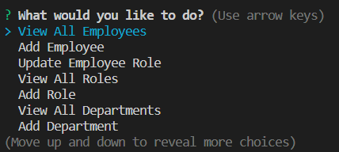
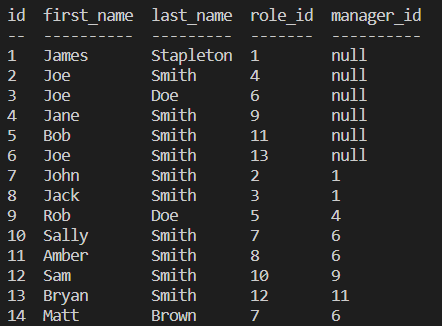
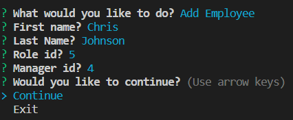

# Employee-Tracker-DB

## Description

This is a command line app to keep track of employees in an organization. The app uses mysql2 and inquirer to create, update and display employee information in a database. It includes methods to view, add and update the department, role and employee tables. It can be run in the terminal using the script npm start, and all functionality is achieved by simply following the prompts. 

